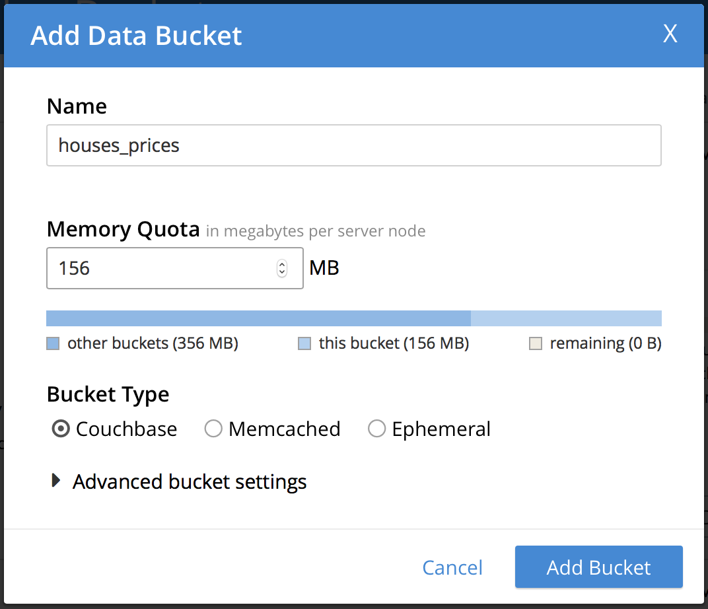
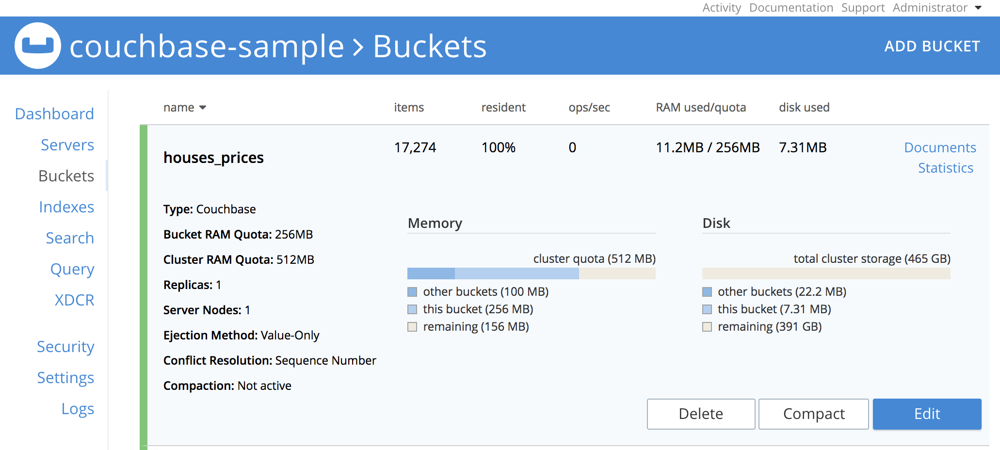
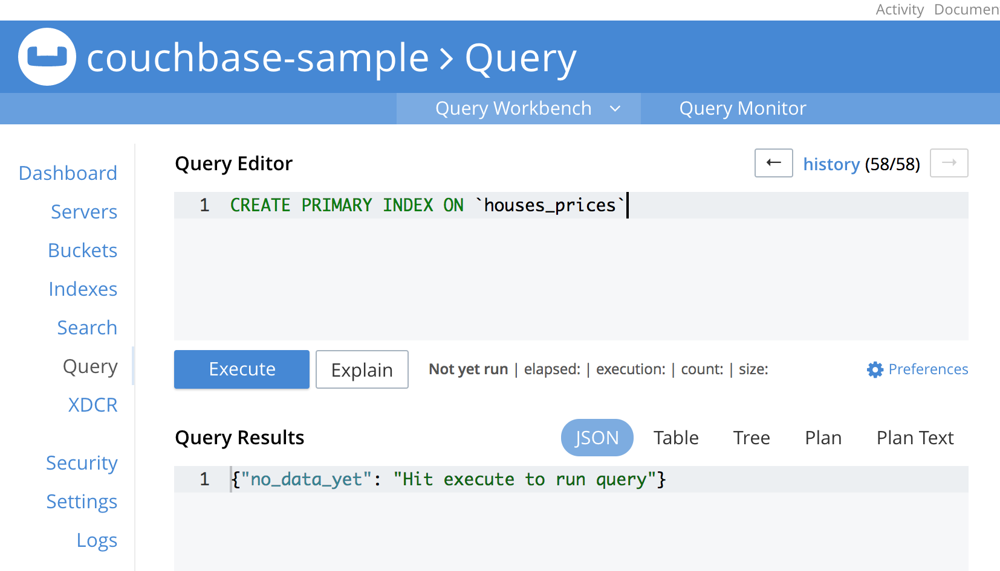

Zero Effort Machine Learning with Couchbase and Spark MLlib
=======================


In the last few years we have witnessed the rise of Machine Learning, a 50+ years old 	
technique that has finally reached the masses. Surprisingly a lot of companies are still not doing anything 
in this field, in part I believe due to the lack of knowledge of how it fits in their business and also because 
for most of the developers it still sounds like black magic, that is why I would like
show you today how you can start with machine learning with almost zero effort.

In the most basic level of machine learning we have something called Linear Regression which is roughly an algorithm 
that tries to "explain" a number by giving weight to a set of features, let's see some examples:

* The price of a house could be explained by things like size, location, number of bedrooms and bathrooms;
* The price of a car could be explained by its model, year, mileage, condition, etc;
* The time spent for a given task could be predicted by the number of subtasks, level of difficulty, worker experience, etc;


There a plenty of use cases were Linear Regression (or other Regression types) can be used, but lets focus in the first
one related to house prices. Imagine we a running a real state company in a particular region of 
the country, as we are not a new company, we do have some data of which were the houses sold in the past and
for how much, in this case each row in our historical data will look like this:

```javascript
  {
    "id": 7129300520,
    "date": "20141013T000000",
    "price": 221900,
    "bedrooms": 3,
    "bathrooms": 1,
    "sqft_living": 1180,
    "sqft_lot": 5650,
    "floors": 1,
    "waterfront": 0,
    "view": 0,
    "condition": 3,
    "grade": 7,
    "sqft_above": 1180,
    "sqft_basement": 0,
    "yr_built": 1955,
    "yr_renovated": 0,
    "zipcode": 98178,
    "lat": 47.5112,
    "long": -122.257,
    "sqft_living15": 1340,
    "sqft_lot15": 5650
  }
```

## The problem

Now imagine you just joined the company and you have to sell the following house:

```javascript
  {       
  "id": 1000001,
  "date": "20150422T000000",
  "bedrooms": 6,
  "bathrooms": 3,
  "price": null,
  "sqft_living": 2400,
  "sqft_lot": 9373,
  "floors": 2,
  "waterfront": 0,
  "view": 0,
  "condition": 3,
  "grade": 7,
  "sqft_above": 2400,
  "sqft_basement": 0,
  "yr_built": 1991,
  "yr_renovated": 0,
  "zipcode": 98002,
  "lat": 47.3262,
  "long": -122.214,
  "sqft_living15": 2060,
  "sqft_lot15": 7316
 }
```
**For how much would you sell it?**

Though question right? Luckily that is exactly the question Linear Regression would help you to answer.


## The Answer

For this tutorial you will need:

* [Couchbase Server 5](https://www.couchbase.com/downloads)
* [Spark 2.2](https://spark.apache.org/releases/spark-release-2-2-0.html)
* [SBT](http://www.scala-sbt.org/download.html) (as we are running using scala)

With your Couchbase Server running, go to the administrative portal at http://127.0.0.1:8091 and create a new bucket called
**houses_prices**




Now lets clone our tutorial code:
`git clone https://github.com/couchbaselabs/couchbase-spark-mllib-sample.git

In root folder there is a file called **house_prices_train_data.zip**, it is our dataset which I borrowed from an old machine 
learning course on Coursera. Please unzip it and then run the following command:

```
./cbimport json -c couchbase://127.0.0.1 -u YOUR_USER -p YOUR_PASSWORD -b houses_prices -d <PATH_TO_UNZIPED_FILE>/house_prices_train_data -f list -g key::%id% -t 4`
```

**TIP:** If you are not familiar with **cbimport** please [check this tutorial](https://developer.couchbase.com/documentation/server/current/tools/cbimport.html)


If your command ran successfully, you should notice that your **houses_prices** bucket has been populated:



For the sake of letting you explore this data let's quickly create an index for it, run the following command in the query editor:

```
CREATE PRIMARY INDEX ON `houses_prices`
```




Now that our environmemt is ready, it is time to code!. 
In the [LinearRegressionExample](https://github.com/couchbaselabs/couchbase-spark-mllib-sample/blob/master/src/main/scala/LinearRegressionExample.scala) class we start by creating the Spark context with our bucket credentials:

```scala

    val spark = SparkSession
      .builder()
      .appName("SparkSQLExample")
      .master("local[*]") // use the JVM as the master, great for testing
      .config("spark.couchbase.nodes", "127.0.0.1") // connect to couchbase on localhost
      .config("spark.couchbase.bucket.houses_prices", "") // open the houses_prices bucket with empty password
      .config("com.couchbase.username", "YOUR_USER")
      .config("com.couchbase.password", "YOUR_PASSWORD")
      .getOrCreate()

```

and then we load all the data from the database.

```scala
val houses = spark.read.couchbase()
```

As spark use a lazy approach, the data is not loaded until it is really needed. Here you can clearly see the beauty of the **Couchbase Connector**
we just converted a JSON Document into a Spark Dataframe with zero effort. In other databases for example, you would be required to export the data to a csv file with some
specific formats, copy it to your machine, load it and do all the boring procedures to convert it to a dataframe (not to mention the cases where the file generated is too big).

In the real world you would need to filter the data instead of just grabbing all data, hopefully our connector is there for you, and you can even
run some N1QL queries with it:

```scala
//loading documents by its type
val airlines = spark.read.couchbase(EqualTo("type", "airline"))

//loading data using N1QL
// This query groups airports by country and counts them.
    val query = N1qlQuery.simple("" +
      "select country, count(*) as count " +
      "from `travel-sample` " +
      "where type = 'airport' " +
      "group by country " +
      "order by count desc")

    val schema = StructType(
        StructField("count", IntegerType) ::
        StructField("country", StringType) :: Nil
    )

    val rdd = spark.sparkContext.couchbaseQuery(query).map(r => Row(r.value.getInt("count"), r.value.getString("country")))
    spark.createDataFrame(rdd, schema).show()

```
**TIP:** There are other a lot of examples of how use couchbase connector [here](https://github.com/couchbaselabs/couchbase-spark-samples/tree/master/src/main/scala)


 


