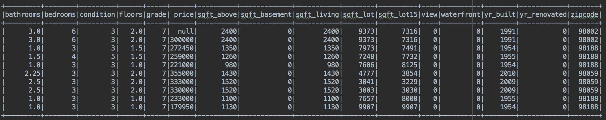
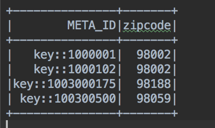
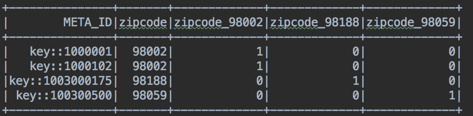
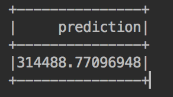

Zero Effort Machine Learning with Couchbase and Spark MLlib
=======================

In the last few years, we noticed how machine learning has been proven to be a technology in which companies should invest massively, you can easily find dozens of papers talking about how company X saved tons of money by adding some level of AI into their process. 
Surprisingly I still notice many industries being skeptical about it and others which think it is "cool" but does not have anything 
in mind yet.

The reason for such dissonance I believe is due to 2 main factors: Many companies have no idea how AI fits in their business and
because for most of the developers, it still sounds like black magic.

That is why I would like to show you today how you can start with machine learning with almost zero effort.

On the most basic level of machine learning, we have something called Linear Regression which is roughly an algorithm 
that tries to "explain" a number by giving weight to a set of features, let's see some examples:

* The price of a house could be explained by things like size, location, number of bedrooms and bathrooms;
* The price of a car could be explained by its model, year, mileage, condition, etc;
* The time spent for a given task could be predicted by the number of subtasks, level of difficulty, worker experience, etc;


There a plenty of use cases were Linear Regression (or other Regression types) can be used, but let's focus on the first
one related to house prices. Imagine we a running a real estate company in a particular region of the country, as we are an old company, we do have some data of which were the houses sold in the past and for how much. 

In this case, each row in our historical data will look like this:

```javascript
  {
    "id": 7129300520,
    "date": "20141013T000000",
    "price": 221900,
    "bedrooms": 3,
    "bathrooms": 1,
    "sqft_living": 1180,
    "sqft_lot": 5650,
    "floors": 1,
    "waterfront": 0,
    "view": 0,
    "condition": 3,
    "grade": 7,
    "sqft_above": 1180,
    "sqft_basement": 0,
    "yr_built": 1955,
    "yr_renovated": 0,
    "zipcode": 98178,
    "lat": 47.5112,
    "long": -122.257,
    "sqft_living15": 1340,
    "sqft_lot15": 5650
  }
```

## The problem - How to price a house

Now imagine you just joined the company and you have to sell the following house:

```javascript
  {       
  "id": 1000001,
  "date": "20150422T000000",
  "bedrooms": 6,
  "bathrooms": 3,
  "price": null,
  "sqft_living": 2400,
  "sqft_lot": 9373,
  "floors": 2,
  "waterfront": 0,
  "view": 0,
  "condition": 3,
  "grade": 7,
  "sqft_above": 2400,
  "sqft_basement": 0,
  "yr_built": 1991,
  "yr_renovated": 0,
  "zipcode": 98002,
  "lat": 47.3262,
  "long": -122.214,
  "sqft_living15": 2060,
  "sqft_lot15": 7316
 }
```
**For how much would you sell it?**

The question above would be very challenging if you never sold a similar house in the past. Luckily now you have the right 
tool for the job: A Linear Regression.


## The Answer - Predicting house prices with Linear Regression

Before you go further, you will need to install the following items:

* [Couchbase Server 5](https://www.couchbase.com/downloads)
* [Spark 2.2](https://spark.apache.org/releases/spark-release-2-2-0.html)
* [SBT](http://www.scala-sbt.org/download.html) (as we are running using scala)

### Loading the Dataset

With your Couchbase Server running, go to the administrative portal at http://127.0.0.1:8091 and create a new bucket called
**houses_prices**


Now let's clone our tutorial code:
```
git clone https://github.com/couchbaselabs/couchbase-spark-mllib-sample.git
```

In root folder there is a file called **house_prices_train_data.zip**, it is our dataset which I borrowed from an old machine 
learning course on [Coursera](https://www.coursera.org/learn/ml-foundations/). Please unzip it and then run the following command:

```
./cbimport json -c couchbase://127.0.0.1 -u YOUR_USER -p YOUR_PASSWORD -b houses_prices -d <PATH_TO_UNZIPED_FILE>/house_prices_train_data -f list -g key::%id% -t 4`
```

**TIP:** If you are not familiar with **cbimport** please [check this tutorial](https://developer.couchbase.com/documentation/server/current/tools/cbimport.html)


If your command ran successfully, you should notice that your **houses_prices** bucket has been populated:


Let's also quickly add a primary index for it:
```
CREATE PRIMARY INDEX ON `houses_prices`
```


### Time to Code!

Now our environment is ready and it is time to code!

In the [LinearRegressionExample](https://github.com/couchbaselabs/couchbase-spark-mllib-sample/blob/master/src/main/scala/LinearRegressionExample.scala) class we start by creating the Spark context with our bucket credentials:

```scala

    val spark = SparkSession
      .builder()
      .appName("SparkSQLExample")
      .master("local[*]") // use the JVM as the master, great for testing
      .config("spark.couchbase.nodes", "127.0.0.1") // connect to couchbase on localhost
      .config("spark.couchbase.bucket.houses_prices", "") // open the houses_prices bucket with empty password
      .config("com.couchbase.username", "YOUR_USER")
      .config("com.couchbase.password", "YOUR_PASSWORD")
      .getOrCreate()

```

and then we load all the data from the database:

```scala
val houses = spark.read.couchbase()
```

As Spark uses a lazy approach, the data is not loaded until it is really needed. You can clearly see the beauty of the **Couchbase Connector** above, we just converted a JSON Document into a Spark Dataframe with zero effort. 

In other databases for example, you would be required to export the data to a csv file with some specific formats, copy it to your machine, 
load and do all the boring procedures to convert it to a dataframe (not to mention the cases where the file generated is too big).

In a real world you would need to do some filtering instead of just grabbing all data, again our connector is there for you, as you can even
run some N1QL queries with it:

```scala
//loading documents by its type
val airlines = spark.read.couchbase(EqualTo("type", "airline"))

//loading data using N1QL
// This query groups airports by country and counts them.
    val query = N1qlQuery.simple("" +
      "select country, count(*) as count " +
      "from `travel-sample` " +
      "where type = 'airport' " +
      "group by country " +
      "order by count desc")

    val schema = StructType(
        StructField("count", IntegerType) ::
        StructField("country", StringType) :: Nil
    )

    val rdd = spark.sparkContext.couchbaseQuery(query).map(r => Row(r.value.getInt("count"), r.value.getString("country")))
    spark.createDataFrame(rdd, schema).show()

```
**TIP:** There are a lot of examples of how use couchbase connector [here](https://github.com/couchbaselabs/couchbase-spark-samples/tree/master/src/main/scala)

Our dataframe still looks exactly as what we had in our database:
```scala
houses.show(10)
```



There are 2 different types of data here, "scalar numbers" such as **bathrooms** and **sqft_living** and "categorical variables" 
such as **zipcode** and **yr_renovated**. Those categorical variables are not just simple numbers, they have a much more 
deep meaning as they are describing a property, in the zipcode case for example, it represents the location of the house.

Linear Regression does not like those kind of categorical variables, so if we really want to use zipcode in our Linear Regression, 
as it seems to be a relevant field to predict the price of a house, we have to convert it to a **dummy variable**, which is 
fairly simple processes:

1. Distinct all values of the target column. 

**Ex:** `SELECT DISTINCT(ZIPCODE) FROM HOUSES_PRICES`

2. Convert each row into a column. 

**Ex:** zipcode_98002, zipcode_98188, zipcode_98059

3. Finally we update those new columns with 1s and 0s according to the value of the zipcode content:

**Ex:**

>
>
>
>The table above will be transformed to:
>
>
>

That is exactly what we are doing in the line bellow:

```scala
val df = transformCategoricalFeatures(houses)
```

Converting categorical variables is a very common procedure and Spark already has some utilities to do this work for you:

```scala
def transformCategoricalFeatures(dataset: Dataset[_]): DataFrame = {
    val df1 = encodeFeature("zipcode", "zipcodeVec", dataset)
    val df2 = encodeFeature("yr_renovated", "yr_renovatedVec", df1)
    val df3 = encodeFeature("condition", "conditionVec", df2)
    encodeFeature("grade", "gradeVec", df3)
  }

  def encodeFeature(featureName: String, outputName: String, dataset: Dataset[_]): DataFrame = {
    val indexer = new StringIndexer()
      .setInputCol(featureName)
      .setOutputCol(featureName + "Index")
      .fit(dataset)

    val indexed = indexer.transform(dataset)

    val encoder = new OneHotEncoder()
      .setInputCol(featureName + "Index")
      .setOutputCol(outputName)

    encoder.transform(indexed)
  }
```
**NOTE:** The final dataframe will not look exactly like the example shown above as it is already optimized to avoid the [The Sparse Matrix](https://en.wikipedia.org/wiki/Sparse_matrix ) problem.


Now we can select the fields we would like to use grouping them in a vector called **features** and renaming the column **price** to **label**:

```scala
//just using almost all columns as features, no special feature engineering here
    val features = Array("sqft_living", "bedrooms",
      "gradeVec", "waterfront",
      "bathrooms", "view",
      "conditionVec", "sqft_above",
      "sqft_basement", "zipcode",
      "sqft_lot", "floors",
      "yr_built", "zipcodeVec", "yr_renovatedVec")

    val assembler = new VectorAssembler()
      .setInputCols(features)
      .setOutputCol("features")

    //the Linear Regression implementation expect a feature called "label"
    val renamedDF = assembler.transform(df.withColumnRenamed("price", "label"))
```

You can play around with those features removing/adding them as you wish, later you can try for example remove the "sqft_living" feature
to see how the algorithm has a much worse performance.

Finally we will only use houses in which the price is not null to train our machine learning algorithm, as our whole goal is to make our
Linear Regression "learn" how to predict the price by a giving set of features.

```scala
    val data = renamedDF.select("label", "features").filter("price is not null")
```    
 
Here is where the magic happens, we split our data in training (80%) and test (20%), but for the purpose of this article let's
ignore the test data. 
Then we create our LinearRegression instance and **fit** our data into it.
 
```scala

//let's split our data in test and training (a common thing during model selection)
    val splits = data.randomSplit(Array(0.8, 0.2), seed = 1L)
    val trainingData = splits(0).cache()
    //let's ignore the test data for now as we are not doing model selection
    val testData = splits(1)

    val lr = new LinearRegression()
      .setMaxIter(1000)
      .setStandardization(true)
      .setRegParam(0.1)
      .setElasticNetParam(0.8)

    val lrModel = lr.fit(trainingData)

```

__The **lrModel** variable is already a trained model capable of predict house prices!__

Before we start predicting things, let's just check some metrics of our trained model:

```scala

    println(s"Coefficients: ${lrModel.coefficients} Intercept: ${lrModel.intercept}")
    val trainingSummary = lrModel.summary
    println(s"numIterations: ${trainingSummary.totalIterations}")
    println(s"objectiveHistory: [${trainingSummary.objectiveHistory.mkString(",")}]")
    trainingSummary.residuals.show()
    println(s"RMSE: ${trainingSummary.rootMeanSquaredError}")
    println(s"r2: ${trainingSummary.r2}")

```

The one that you should care here is called [RMSE - Root Mean Squared Error](https://en.wikipedia.org/wiki/Root-mean-square_deviation) which roughly is the
average deviation of __what our model preditcs X the actual price sold__.
>
>RMSE: 147556.0841305963
>
>r2: 0.8362288980410875
>
On average we miss the actual price by $147556.0841305963, which is not bad at all considering we barely did any [feature engineering](https://en.wikipedia.org/wiki/Feature_engineering) or
removed any outliers (some houses might have inexplicable high or low prices, and it might mess up with your Linear Regression)

There is only one house with a price missing in this dataset, exactly the one that we pointed in the beginning:
```scala

    val missingPriceData = renamedDF.select("features")
      .filter("price is null")

    missingPriceData.show()
```

And now we can finally predict the expected house price:

```scala
    //printing out the predicted values
    val predictedValues = lrModel.transform(missingPriceData)
    predictedValues.select("prediction").show()

```


Awesome, isn't it?

For production purpose you would still do some [model selection](https://en.wikipedia.org/wiki/Model_selection) first, check other metrics, and save the model instead of training it on the fly, but it's amazing how much can be done with less than 100 lines of code!


If you have any questions, feel free to ask me on twitter at [@deniswsrosa](https://twitter.com/deniswsrosa) or ask on our [forum](https://forums.couchbase.com).
